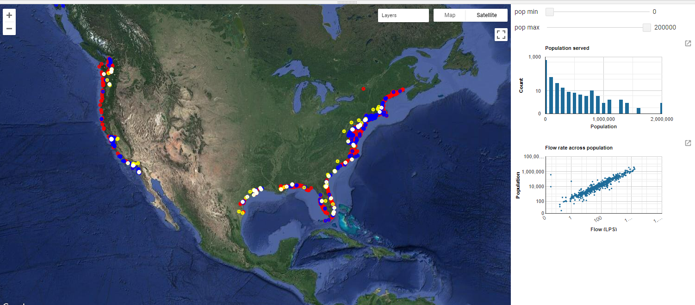
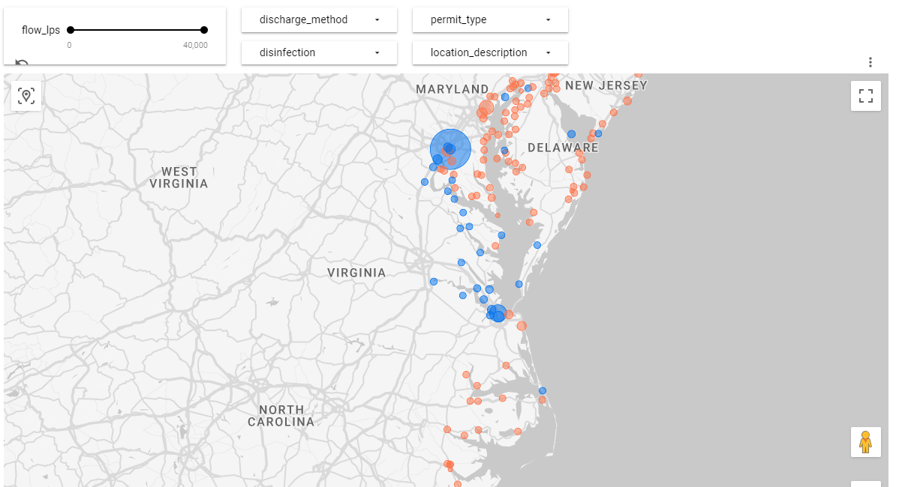

# CWNS and Power Stations Locations with Proximity to Coastline

This repo is used in a data pipeline to take CWNS data and Power Station data and calculate proximity to coastline.  This repeats the process for proximity to train and port locations. 

This expects the data sources to be downloaded and existing in the same folder. 

The `main.js` file in `ee-source` can be used in Google Earth Engine to produce an output such as this:



This can can also be used in Google Looker to produce the following:



## Distance to coast

Adapted from [Find closest point to shapefile coastline in Python](https://gis.stackexchange.com/questions/372035/find-closest-point-to-shapefile-coastline-in-python/372232#372232).

## Data used

[Intermodal Freight Facilities Marine Roll-on/Roll-off](https://data-usdot.opendata.arcgis.com/datasets/usdot::intermodal-freight-facilities-marine-roll-on-roll-off/about)

[Intermodal Freight Facilities Rail TOFC/COFC](https://data-usdot.opendata.arcgis.com/datasets/usdot::intermodal-freight-facilities-rail-tofc-cofc/about)

[Clean Watersheds Needs Survey (CWNS) – 2012 Report and Data](https://www.epa.gov/cwns/clean-watersheds-needs-survey-cwns-2012-report-and-data)

[Natural Earth 50m Coastline](https://www.naturalearthdata.com/downloads/50m-physical-vectors/50m-coastline/)

[WRI Global Power Plant Database](https://datasets.wri.org/dataset/globalpowerplantdatabase)

[Thermoelectric cooling water data](https://www.eia.gov/electricity/data/water/)

## Prerequisites

You will need an OpenAI API key to get started. 

### 1. Create the config file

Copy `config.sample.ini` to `config.ini` and customize. 


### 2. Set up your python environment

```bash
python -m venv env

source env/bin/activate

pip install -r requirements.txt
```

also run: 

```bash
pip install wheel
pip install earthengine-api --upgrade
```

## Running

```bash

# the first script must run in windows bash, needs ODBC to query mdb
python 1-mdb-to-csv.py
python 2-cwns-calculate-distance-to-coast.py
python 3-power-calculate-distance-to-coast.py
python 4-transport.py
python 5-distance-to-transport.py
python 6-earth-engine.py

```